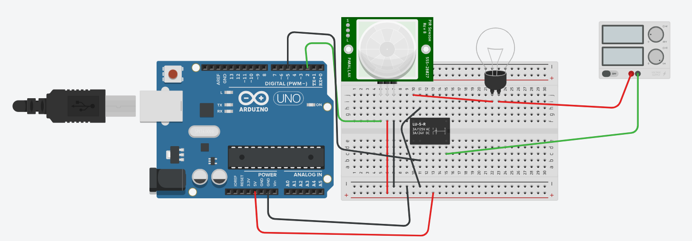

# Arduino Automatic Lighting System with PIR Motion Sensor

A simple, energy-saving home automation project that automatically turns lights on when motion is detected and off after a period of inactivity. Perfect for hallways, entryways, or closets!

## Features

*   Motion-activated light control.
*   Energy-efficient: light turns off when no one is present.
*   Easy to build for beginners.
*   Simulated and tested in Tinkercad.

## Components Used

*   **Arduino Uno R3** (The brain of the system)
*   **PIR Motion Sensor** (HC-SR501 recommended for real-world)
*   **Relay Module** (e.g., 5V Single Channel Relay Module)
*   **Light Bulb** (LED or incandescent, depends on your relay's capacity)
*   Breadboard (for prototyping)
*   Jumper Wires
*   5V Power Supply (for Arduino)

## Circuit Diagram & Wiring

Here's how to connect the components.



*   **PIR Sensor to Arduino:**
    *   VCC (PIR) -> 5V (Arduino)
    *   GND (PIR) -> GND (Arduino)
    *   OUT (PIR) -> Digital Pin 2 (Arduino)
*   **Relay Module to Arduino:**
    *   VCC (Relay) -> 5V (Arduino)
    *   GND (Relay) -> GND (Arduino)
    *   IN (Relay) -> Digital Pin 5 (Arduino)
*   **Light Bulb & External Power Supply (through Relay):**
    *   Connect one side of the light bulb to the Live/Positive of your external power supply.
    *   Connect the Neutral/Negative of your external power supply to the **Common (COM)** pin of the Relay.
    *   Connect the other side of the light bulb to the **Normally Open (NO)** pin of the Relay.

**Interactive Tinkercad Simulation:**
You can explore the circuit and run the simulation directly in your browser here: 
https://www.tinkercad.com/things/5ggnVsAdmAc-automatic-lightning-system

**Demo Video:**
Watch the project in action on YouTube: https://youtu.be/C9k2AC_FBfg

## Arduino Code

The Arduino code (`automatic_light_system.ino`) monitors the PIR sensor's output and controls the relay module accordingly.

```cpp
// C++ code for an Automatic Lighting System with PIR Motion Sensor

// Define the pin numbers for our components
int pir = 2;   // The PIR motion sensor's output pin is connected to Arduino Digital Pin 2
int bulb = 5;  // The relay module (controlling the light bulb) is connected to Arduino Digital Pin 5

void setup()
{
  // Initialize serial communication for debugging (optional, but good practice)
  // Serial.begin(9600); 

  // Set the PIR sensor pin as an INPUT, because we'll be reading data from it
  pinMode(pir, INPUT);

  // Set the bulb (relay) pin as an OUTPUT, because we'll be sending signals to control the light
  pinMode(bulb, OUTPUT);
}

void loop()
{
  // Read the state of the PIR sensor.
  // If motion is detected, digitalRead(pir) will be HIGH.
  // If no motion, it will be LOW.
  if (digitalRead(pir) == HIGH) {
    // If motion is detected, turn the light ON (send a HIGH signal to the bulb pin)
    digitalWrite(bulb, HIGH);
    // Serial.println("Motion detected! Light ON."); // Optional: print message to Serial Monitor

    // Add a small delay to debounce the sensor or keep the light on momentarily.
    // Adjust this value if the light flickers or turns off too quickly.
    delay(200); // Wait for 200 milliseconds (0.2 seconds)
  } else {
    // If no motion is detected, turn the light OFF (send a LOW signal to the bulb pin)
    digitalWrite(bulb, LOW);
    // Serial.println("No motion. Light OFF."); // Optional: print message to Serial Monitor
  }
}
